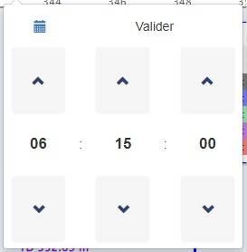

# Rapport d'expérience professionnelle

Formation développeur d'application frontend

Projet 9 : Construisez une veille technologique et effectuez un stage.

  

  X

  

## Sommaire

 - I - [Remerciements](#remerciements)
 - II - [Contexte](#contexte)
 - III - [Problématique](#problematique)
 - IV - [Missions confiées](#missions)
    - a - [Reprise de la bibliothèque SVG des lithologies](#svg)
    - b - [Amélioration du tooltip d’information des graphiques](#tooltip)
    - c - [Correction générale du CSS de l’interface](#css)
    - d - [Debug](#debug)
 - V - [Bilan](#bilan)

## I -  Remerciements

Je tiens à remercier tout particulièrement mon mentor de formation, [`Stan Daniels-Roth`](https://daniels-roth-stan.fr/) aka [`@MrStanDu33`](https://github.com/MrStanDu33), qui m'a suivi pendant plus de deux ans de formation au sein d'OpenClassrooms.
Pour toute l'expérience qu'il a su m'apporter, sa passion et son dévouement m'ont été d'une grande aide pour m'orienter et me guider dans la réalisation de chaque projet d'école et même au-delà.

Je tiens également à dire un grand merci au serveur Discord [`Sans prise de tech`](discord.gg/spdt) ou l'entraide et la bonne humeur sont toujours présentes. Merci à tous ceux qui m'ont aidé à avancer.

Merci aussi à l'équipe [`Wellcoms Drilling & Geology`](https://www.wellcoms.fr/) pour l'accueil dans leur structure, qui m'a permis d'avoir cette première expérience dans le monde professionnel.

Et enfin merci à [`OpenClassrooms`](https://openclassrooms.com/fr/) pour m'avoir permis de mettre un pied dans le monde du développement et rendu cette formation possible.

## II -  Contexte

Qui suis-je ?

Je me présente, Yannis Almanric, 29 ans.
Je suis depuis deux ans, en alternance chez la société Wellcoms Drilling & Geology en tant que développeur front-end.

L'organisation qui m'accueille, basée en France, est spécialisée dans la création d'outils informatique pour de la transmission et de la visualisation de données depuis 15 ans.
Elle est spécialisée dans la récupération et le traitement de données relatives au forages pétroliers, en utilisant les standards de l'industrie, c'est à dire principalement du WITSML (langage de balises basé sur XML).
L'équipe est constituée de plusieurs développeurs, un ingénieur recherche et développement, un administrateur système, un géologue, un commercial relation client, une équipe de support client et une équipe administrative.

Mon choix s'est porté sur cette entreprise car elle proposait un environnement propice à l'apprentissage, avec une petite équipe, un esprit familial et le temps nécessaire pour monter en compétence avant de se lancer dans des projets plus complexes.
De plus l'environnement technique correspondait parfaitement aux attentes de la formation, avec JavaScript/jQuery utilisé des deux côtés. Ainsi qu'un nouveau projet interne à l'entreprise en Vue.js, technologie que j'ai pu utiliser et approfondir dans le projet `Lancez votre propre site d'avis de restaurants`.

En ce qui concerne mes objectifs de formation, je compte améliorer ma maîtrise du JavaScript, une fois les différents concepts de bases acquis, améliorer la structure du code, chercher l'optimisation.

Mes objectifs après la formation ce serait de continuer à me spécialiser en intégration, JavaScript et Vue.js.

## III -  Problématique

Comment garantir le succès d'implémentation d'une nouvelle feature dans une application web existante ?

## IV -  Missions confiées

### a - <a name="svg"> Reprise de la bibliothèque SVG des lithologies

Pourquoi le SVG (Scalable Vector Graphics) ?
Afin d'avoir un affichage graphique qu'on puisse zoomer/dézoomer sans perte de qualité grâce au vectoriel.

La lithologie va représenter un échantillon des couches géologiques, pour chaque nature de roche différente, on va appliquer une légende.

On a repris le format, afin que chaque motif ait la même dimension et corrigé certaines erreurs de code, de positionnement, voir même refaire certains motifs.

| motif en 50 px | motif en 100 px | motif en 300 px |
|:--------------:|:---------------:|:---------------:|
| |  |  |

Exemple de code SVG :

### b - <a name="tooltip"> Amélioration du tooltip d’information des graphiques

Ici le but était d'avoir un tooltip d'informations des courbes complet. 

On a donc ajouté le nom de la courbe, la valeur du point actuellement survolé, le minimum et le maximum possible de la courbe, la couleur.
On a ajouté comme option le choix d'afficher le tooltip pour toutes les tracks en même temps, ou uniquement la track survolé

### c - <a name="css"> Correction générale du CSS de l’interface

Pour la correction générale du CSS, il fallait reprendre la barre de navigation commune et chaque section de l'application.
Plusieurs problèmes ont été rencontrés, du CSS et du Less anciens, éparpillés dans plusieurs dossiers. 
Du CSS de Bootstrap pouvait venir entrer en conflit avec certaines parties, notamment à cause de l'utilisation du tag `!important`.

La solution encore en cours d'amélioration qui a été apportée, c'est l'utilisation de Sass avec un regroupement du CSS et l'utilisation d'une architecture qui se rapproche du 7.1.
C'est à dire l'utilisation de plusieurs dossiers afin de bien séparer chaque section et composants du site, afin de mieux s'y retrouver.
Certaines possibilitées du CSS3, qui étaient très peu utilisées, notamment flexbox, ont largement été déployées afin de faciliter la construction et la maintenabilité du style.

### d - <a name="debug"> Debug

Le debug concerne principalement la nouvelle feature, la visualisation graphique du WITSML.

Example de WITSML :

L'un des outils le plus utilisé pour cette nouvelle feature est la librairie graphique HighCharts. Pour les besoins métiers relatif à notre domaine, nous avions besoins d'afficher les courbes en profondeur, afin de représenter les puits de forage.

- Courbes logarithmiques

La valeur prédéterminée de la largeur de la piste (pour afficher la courbe), était considérée comme `NaN`, il fallait donc bien s'assurer du format qui arrivait. Si celui-ci n'était pas valide, on recalculait la largeur de la piste en fonction du nombre de pistes déjà présentes.

- Labels

Les labels correspondent à un affichage de la courbe sous forme de texte. On affiche seulement x points de la courbe et ils apparaissent avec leur valeur correspondante.

Le problème se trouvait dans le placement des labels, on pouvait configurer le décalage (offset) souhaité, celui-ci n'était pas pris en compte.

Il a également fallu résoudre un problème de texte qui était doublé et qui donnait un effet d'ombre non désiré.
  
- Datetime picker

Le datetime picker qui est utilisé est celui de Bootstrap. Il est ici utilisé pour naviguer à travers la représentation graphique des puits de forages. La plage de sélection possible correspond aux dates entre le début et la fin de l'exploitation, ou la dernière date possible si le forage est en cours.

 

Il y avait plusieurs problèmes, tout le style n'était pas pris en compte. Certains chemin d'accès étaient cassés.
Il fallait également rajouter un bouton de validation.

- Download graphique

La librairie utilisée, HighCharts, permet un export des graphiques sous différents formats (PDF, PNG, JPEG, SVG).

Il y avait plusieurs problèmes ici, par défaut on passait par le serveur HighCharts pour télécharger les graphiques, ce qui peut déjà poser un problème de sécurité. Il y avait également un problème sur la gestion de taille des fichiers, en cas de grand nombre de pistes et de graphiques, le téléchargement ne pouvait pas s'effectuer.

Nous avons choisi d'utiliser le module `Client side export` afin de pouvoir télécharger les graphique coté client. Il fallait donc inclure le module `offline-exporting.js` dans les scripts et desactiver le téléchargement par le serveur dans les options de l'API HighCharts.

Il fallait également afficher les informations sur le puit téléchargé comme son nom, le nom du canvas. On pouvait utiliser le paramètre `title` du graphique pour mettre ces informations, et elles étaient bien prises en compte dans les paramètres du téléchargement.

Et enfin nous avons ajouté les informations sur le puit et la date pour le nom du fichier téléchargé.

- Download data

Toujours avec HighCharts, on a la possibilité de faire un export des données au format CSV ou XLS (format tableur) pour avoir le tableau des données du graphique (sur le range selectionné)

Dans le header du tableau il manquait les unités pour chaque courbe, il fallait donc les ajouter.

- Datatable

Ici nous avons un peu le même comportement que download data mais avec une visualisation du tableau de données directement dans le navigateur.

- Messages graphiques
- Update data

- Refactoring mergeDataCache() 

Mise à jour de la fonction qui permet s'occuper des nouvelles données lors de la navigation
Tri des datas, s'assurer de l'unicité des data reçues, éviter l'accumulation à chaque changement de range

## V -  Bilan

 - Apprentissage
 - Utilisation d'une librairie graphique (HighCharts)
 