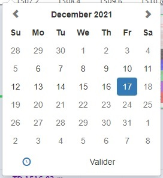
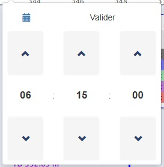

# Rapport d'expérience professionnelle

Formation développeur d'application frontend

Projet 9 : Construisez une veille technologique et effectuez un stage.

## Sommaire

 - I - [Remerciements](#remerciements)
 - II - [Contexte](#contexte)
 - III - [Problématique](#problematique)
 - IV - [Missions confiées](#missions)
    - a - Reprise de la bibliothèque SVG des lithologies
    - b - Amélioration du tooltip d’information des graphiques
    - c - Correction générale du CSS de l’interface
    - d - Debug
 - V - [Bilan](#bilan)

## I -  Remerciements

Je tiens à remercier tout particulièrement mon mentor de formation, `Stan Daniels-Roth`, qui m'a suivi pendant plus de deux ans de formation au sein d'OpenClassrooms.
Pour toute l'expérience qu'il a su m'apporter, sa passion et son dévouement m'ont été d'une grande aide pour m'orienter et me guider dans la réalisation de chaque projet d'école et même au-delà.

Je tiens également à dire un grand merci au serveur Discord `Sans prise de tech` ou l'entraide et la bonne humeur sont toujours présentes. Merci à tous ceux qui m'ont aidé à avancer.

Merci aussi à l'équipe `Wellcoms Drilling & Geology` pour l'accueil dans leur structure, qui m'a permis cette première expérience dans le monde professionnel.

Et enfin merci à `OpenClassrooms` pour m'avoir permis de mettre un pied dans le monde du developpement et rendu cette formation possible.

## II -  Contexte

Qui suis-je ?

Je me présente, Yannis Almanric, 29 ans.
Je suis depuis presque deux ans, en alternance chez la société `Wellcoms Drilling & Geology` en tant que développeur front-end.

L'organisation qui m'accueille, basée en France, est spécialisée dans la création d'outils informatique pour de la transmission et de la visualisation de données depuis 15 ans.
Elle est spécialisée dans la récupération et le traitement de données relatives au forages pétroliers en utilisant les standards de l'industrie, c'est à dire principalement du WITSML (langage de balises basé sur XML).
L'équipe est constituée de plusieurs développeurs, un ingénieur recherche et développement, un administrateur système, un géologue, un commercial relation client, une équipe de support client et une équipe administrative.

Mon choix s'est porté sur cette entreprise car elle proposait un environnement propice à l'apprentissage, avec une petite équipe, un esprit familial et le temps nécessaire pour monter en compétence avant de se lancer dans des projets plus complexes.
De plus l'environnement technique correspondait parfaitement aux attentes de la formation, avec JavaScript/jQuery utilisé des deux côtés. Ainsi qu'un nouveau projet interne à l'entreprise en Vue.js, technologie que j'ai pu utiliser et approfondir dans le projet `Lancez votre propre site d'avis de restaurants`.

En ce qui concerne mes objectifs de formation, je compte améliorer ma maîtrise du JavaScript, une fois les différents concepts de bases acquis, améliorer la structure du code, chercher l'optimisation.
+ nouveaux objectifs

## III -  Problématique

Comment garantir le succès d'implémentation d'une nouvelle feature dans une application web existante ?

## IV -  Missions confiées

### a - Reprise de la bibliothèque SVG des lithologies

Pourquoi le SVG (Scalable Vector Graphics) ?
Afin d'avoir un affichage graphique qu'on puisse zoomer/dézoomer sans perte de qualité grâce au vectoriel.

La lithologie va représenter un échantillon des couches géologiques, pour chaque nature de roche différente, on va appliquer une légende.

On a repris le format, afin que chaque motif ait la même dimension et corrigé certaines erreurs de code, de positionnement, voir même refaire certains motifs.

Exemple de motif en 50 px : 

Exemple de motif en 100 px : 

Exemple de motif en 300 px : 

Exemple de code SVG : 

 - (ajout, correction)

### b - Amélioration du tooltip d’information des graphiques

Ici le but était d'avoir un tooltip d'informations des courbes complet. 

On a donc ajouté le nom de la courbe, la valeur du point actuellement survolé, le minimum et le maximum possible de la courbe, la couleur.
On a ajouté comme option le choix d'afficher le tooltip pour toutes les tracks en même temps, ou uniquement la track survolé

### c - Correction générale du CSS de l’interface

Pour la correction générale du CSS, il fallait reprendre la barre de navigation commune et chaque section de l'application.
Plusieurs problèmes ont été rencontrés, du CSS et du Less anciens, éparpillés dans plusieurs dossiers. 
Du CSS de Bootstrap pouvait venir entrer en conflit avec certaines parties, notamment à cause de l'utilisation du tag `!important`.

La solution encore en cours d'amélioration qui a été apportée, c'est l'utilisation de Sass avec un regroupement du CSS et l'utilisation d'une architecture qui se rapproche du 7.1.
C'est à dire l'utilisation de plusieurs dossiers afin de bien séparer chaque section et composants du site, afin de mieux s'y retrouver.
Certaines possibilitées du CSS3, qui était très peu utilisées, notamment flexbox, ont largement été déployées afin de faciliter la construction et la maintenabilité du style.

### d - Debug

Le debug concerne principalement la nouvelle feature, la visualisation graphique du WITSML.

Example de WITSML :

- Courbes logarithmiques

La valeur prédéterminée de la largeur de la piste (pour afficher la courbe), était considérée comme `NaN`, il fallait donc bien s'assurer du format qui arrivait. Si celui-ci n'était pas valide, on recalculait la largeur de la piste.

- Labels

Les labels correspondent à un affichage de la courbe sous forme de texte. On affiche seulement x points de la courbe et ils apparaissent avec leur valeur correspondante.

Le problème se trouvait dans le placement des labels, on pouvait configurer le décalage (offset) souhaité, celui-ci n'était pas pris en compte.

Il a également fallu résoudre un problème de texte qui était doublé et qui donnait un effet d'ombre non désiré.
  
- Datetime picker

Le datetime picker qui est utilisé est celui de Bootstrap. Il est ici utilisé pour naviguer à travers la représentation graphique des puits de forages. La plage de sélection possible correspond aux dates entre le début et la fin de l'exploitation, ou la dernière date possible si le forage est en cours.

 

Il y avait plusieurs problèmes, tout le style n'était pas pris en compte. Certains chemin d'accès étaient cassés.
Il fallait également rajouter un bouton de validation.
- Export graphique PDF/PNG/JPEG
  - Télécharger le graphique visualisé
- Download data (CSV/XLS)
  - Télécharger les tableau de données du graphique
- Datatable
  - Afficher le tableau de données du graphique directement dans le navigateur
- Messages graphiques
- Update data
- Tri des datas, s'assurer de l'unicité des data reçues, éviter l'accumulation à chaque changement de range

## V -  Bilan

 - Apprentissage
 - Utilisation d'une librairie graphique (HighCharts)
 